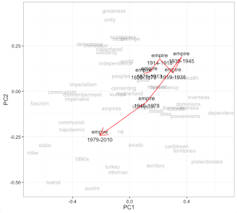

# Word Embedding

**Raf Alvarado**

UVA DS 5559  
02 April 2019

---

## Business

* Has everyone been able to get `MALLET` to run?
* Has everyone been able to get `Polo` to run?

---

#### The Shot


---

## Review

* Topic models are useful in studying **culture and history**
  * They reveal themes in literature, as well as political and cultural change
  * They reveal patterns of both **structure and process**
* **Heteroglossia**, a key concept in socipology of language that can be linked to other processes, is indexed by **topic mixtures** ($\theta_{d}$)
  * We can use **KLD** (and other similarity measures) between topic mixtures to describe linguistic change
  * and **Mutual information** between topics in documents-as-baskets to infer **cultural networks**
* All methods derive from $\phi$ and $\theta$ tables
  * Produced by a tools like `MALLET`  (with help of `Polo`)

---

### Literature and History

Literary themes are expressions of **psychological facts**

These facts influence **real behavior** and hence **history**

Remember that human behavior is shaped by **verstehen**

Texts, whether fictional or non-fictional, reveal this level of meaning

Like topic models, **word embedding** provide insight into language and culture

---

### Social Drama

The relationship between literature and history can be visualized this way:


The theory of social drama states that the same principles that govern dramatic action in theater also function in social life

The one influences the other in a loop

Process related the cybernetic **concept of governance** we discussed earlier

---

## So, What are Word Embeddings?

* A class of **unsupervised algorithms** for learning **the meanings of words**
* Based on the **vector representations** of words in contexts
  * Contexts = 'embeddings'
* Augments the language model (vocab table) in our schema
* Among other things, these vectors can be combined linearly, forming a **semantic algebra**
  * $vec(king) - vec(male) + vec(female) ~= vec(queen)$
* This is very exciting because it
  * overcomes the problem of meaning posed by **Shannon's theory of information**
  * provides insight into **analogical thinking and classification** -- the cognitive foundation of culture

---

#### Right and Left


<br/><p style="text-align:right;">These are classic works in cultural anthropology that provide evidence for **the universality of right and left as a symbolic operator** used to classify the social world.</p>

---

## Words and Contexts

* We have already seen this in Turney and Pantel's 2010 discussion of **Word-Context Matrices**<sup>1</sup>
  * "A word may be represented by a vector in which the elements are derived from the occurrences of the word in various contexts." (p. 148)
    * windows of words (Lund & Burgess 1996)
    * grammatical dependencies (Lin, 1998; Padó & Lapata 2007)
    * dependency links and selectional preferences on the argument positions (Erk & Padó 2008)
    * see Sahlgren (2006) for a comprehensive study of various contexts
* Topic models also provide implicit embeddings -- topics as contexts
  * The transpose of the $\phi$ matrix becomes a word embedding matrix
* Also similar to McClure's mental maps
* The idea is that  **similar row vectors in the word–context matrix indicate similar word meanings.**
* <sup>1</sup> *From Frequency to Meaning*

---

## The Distributional Hypothesis

* More generally, word embedding is based on the **distributional hypothesis** from Zellig Harris, a structural linguist in the 1940s and '50s
  * Part of a school of thought that was eclipsed by Chomsky's generative grammar
  * Harris's essay ahead of its time &mdash; worth a read
* Main idea &mdash;
  * **Words that occur in similar contexts tend to have similar meanings** (Harris 1954)
  * Or: **a word is characterized by the company it keeps** (Firth 1957)
* In practical terms &mdash;
  * **If words have similar row vectors in a word–context matrix, then they tend to have similar meanings**
* Basis for field of **statistical semantics**

---

### Mayan Decipherment

The field of **Mayan epigraphy** bears this out

The breakthrough in decichpering the hieroglyphs was based on the application of this principle


These signs mean the same thing

Their similarity was discovered through their common subsitution patterns

---

### Place of WE in Ontology of Text Analytics

**Words**  
Language Models, LSA, *Word Embedding*

**Topics**  
LSI, Topic Models (LDA)

**Documents**  
Summarization, Clustering, and Classification, Document Models (OHCO, TEI)

---

## Uses for Word Embedding

* **More features** for training data!
* Semantic networks for linguistic disamguition, named entity recognition, **NLP annotation in general**, etc.
* Study of **analogy** -- culture built on systems of **analogical classification**
* **Semantic change** (historical semantics)
* Today, we will look at the last two
  * We will look at implemention details on Thursday

---

## HISTORICAL SEMANTICS

* Paper by Hamilton, Leskovec, and Jurafsky (2018)
* Uses word embeddings to explore **statistical laws of semantic change**
* Provides good **comparison of various word embedding methods**
  * PPMI, SVD, and SGNS (word2vec)
* Provides good examples for testing significance of findings
* Derives **two laws of semantic change**:
  * Law of **conformity** and Law of **innovation**
  * &mdash;  This is kind of a big deal :-)

---

## Method

* Take **six large corpora** from **four languages** over **two centuries**
* Create word embeddings for each corpus and then for each language align time-based groups
  * Alignment of embeddings tricky for SVD and SGNS because components are opaque
  * To solve, they use "orthogonal Procrustes"
* Run tests based on known semantic shifts

---

### Word Paths


---

### Word Paths

PCA used to visualize the movement of the word "empire" in British discourse


<p style="text-align:right;"><i>I would gloss this to say that "empire" remains in a relatively similar semantic space until 1945, although it drifts from a space of national "greatness", "unity", and "solidarity" towards a more technical language of "dependencies" and "possessions." But then after 1945 the parliamentarians tend to forget that they ever had an empire at all; in the post-Thatcher period, the British speak of "empire" in the same breath as "Stalinism," "Napoleonic" adventures, and the "Asiatic" empires of the past."</i> (Ben Schmidt)</p>

---

### Known Semantic Changes


---

### Some Discovered Semantic Changes

Top 10 word shifts by method


---

### Two Laws

Two laws governing rates of semantic change


Since polysemous words are also frequent, these laws are in tension

*What might account  for these laws?*

---

## Comparing Methods

*All methods are based on a co-occurrence matrix of words based on their appearance in a sliding window*

* **PPMI** (Positive Pointwise Mutual Information)
  * Takes only positive mutual info between terms (Normally, $MI \in [-1,1]$ )
  * Intuitive, alignable (across different collections), but does not perform well due to sensitivity to rare events
* **SVD** (Singular Value Decomposition)
  * Like LSI, but applied to words not documents
  * Sensitive, works well in smaller corpora, prone to artifacts
* **SGNS** (Skipgram with Negative Sampling)
  * Robust, not as sensitive, better for discovered  shifts and visualizing change
  * Employs a neural network to infer embeddings
  * Implemented by word2vec and GloVe

---

### Method Peformance Comparison

 

---

## A note of caution

* Ben Schmidt's blog essay, "Some notes on corpora for diachronic word2vec," shows enthusiasm for this paper
  * Schmidth is a digital historian at Northeastern
* Cites some cautionary research &mdash; Hellrich and Udo,  "Bad Company—Neighborhoods in Neural Embedding Spaces Considered Harmful" suggests that SGNS (word2vec) "shouldn't be used because the random seeding produces unreliably different neighborhoods for words."
* However, they rely on Google's dicey 2005-2009 ngram data ...

---

## ANALOGY

* In addition to exploring semantic change, word embeddings allow use to explore **semantic structure**
* This is because word embeddings exhibit a property of **linear combinability**
  * If you add and substract words, you get other words  &mdash; and these new words actually make sense
    * $vec(king) - vec(male) + vec(female) ~= vec(queen)$
  * We may call this **semantic algebra**
* Again, this provides extremely useful insight into culture

---

#### PCA Display of Analogies

Here a some  analogies viewed in PCA space, showing the consistency of the analogy
<div>

</div>

---

#### Analogy as Color Bars

One way to visualize how this works is to visual the word vectors (generated by GloVes) as color bars, where color corresponds to weight


---

### Classical Analogy

```text
                     A : B :: C : D

                       A ------- B
                            |
                            |
                            |
                       C ------- D

             King : Male :: Queen : Female
```

---

### Analogy in Semantic Algebra

```text
                      A - B + D = C
                            -
                       A ------- B
                            |
                            |       +
                            |
                       C ------- D
                            =
        v(King) - v(Male) + v(Female) ~= v(Queen)
```

---

### Terms of  Analogy as Subject and Predicate

```text
                       A ------- B
                            |
                            |
                            |
                       C ------- D

                A and C are Subjects (S1, S2)
                B and D are Predicates (P1, P2)

                     S1 - P1 + P2 = S2
```

Hypothesis &mdash; The semantic algebra invovles replacing predicates to infer subjects

If so, *we can use collections of analogies in a propositional calculus to make knowledge claims*

---

### Parting Question

How to find out if `male : female :: right : left`?
