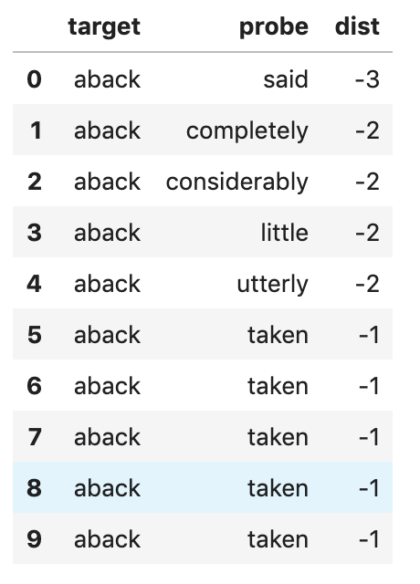
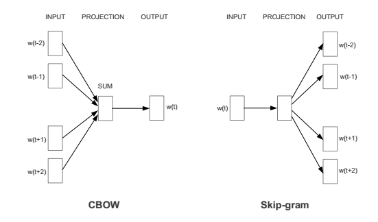

# Lab 10

**Raf Alvarado**

DS 5559  
04 April 2019

---

## More about Word Embeddings

* Special case of what computational linguists call **distributional semantic models**
  * Also called  "word space models"
    * Confusing, since "word" and "vector" are not really substitutes, i.e. word space models are also vector space models
    * So, perhaps **word vector spaces**?
  * Many variants besides word2vec and GloVe
  * You don't need neural nets to create decent embeddings

---

## More about Word Embeddings  (cont'd)

* Not just about contiguity, similarity, and analogy:
  * $apple - apples = car - cars$
  * $Iraq - Violence = Jordan$
  * $Human - Animal = Ethics$
  * $President - Power = Prime Minister$
  * $Library - Books = Hall$
  * $Stock Market ≈ Thermometer$

---

## Word Embeddings Built on New Vector Space

* We have seen *document-term, offset-term, topic-term,  document-topic* ...
* Word embeddings depend on a variations of this &mdash; *window-term*

---

### Table Version

Note that this supports both CBOW and Skipgram

---

### CBOW and Skipgram

CBOW means **continuous bag of words**

Skipgrams are **non-contiguous ngrams**

Both are defined with respect to a **window width**&mdash;the number of words before and after a central word

I call this model **sliding-window of words**

---

### CBOW and Skipgram (cont'd)

CBOW and Skipgram refer to ways of **inputing this data model into a neural network**
**Skipgram** input means you predict context words  
**CBOW** means you predict the central word

---

## Plan

* Implement from scratch SVD with PPMI
* Visualize word2vec embeddings with tSNE
* Explore pretrained embeddings from GloVe
