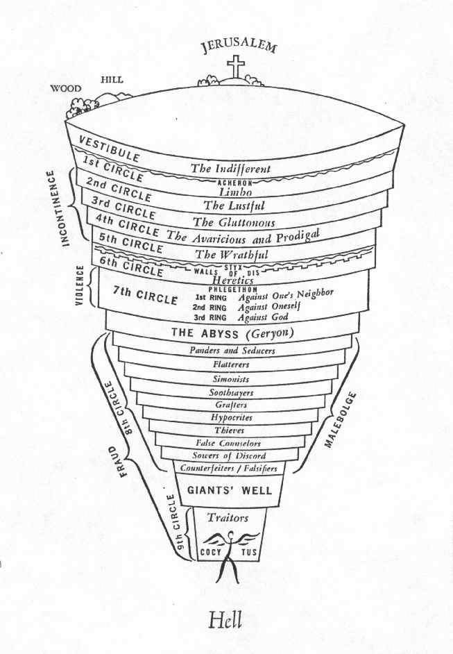
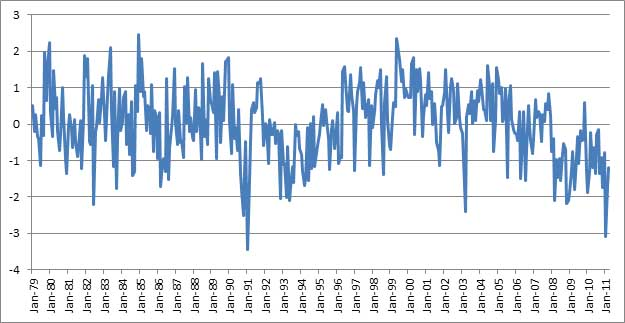
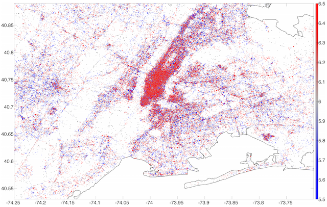
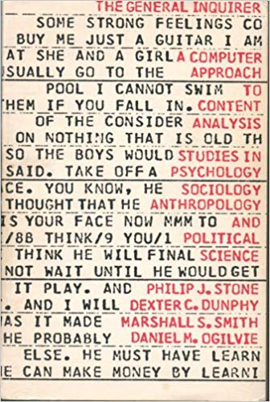
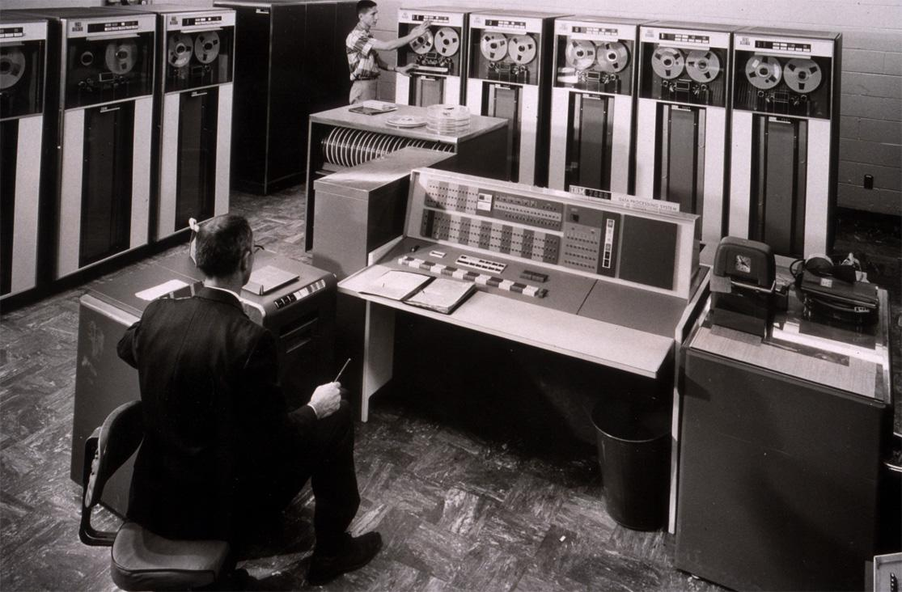
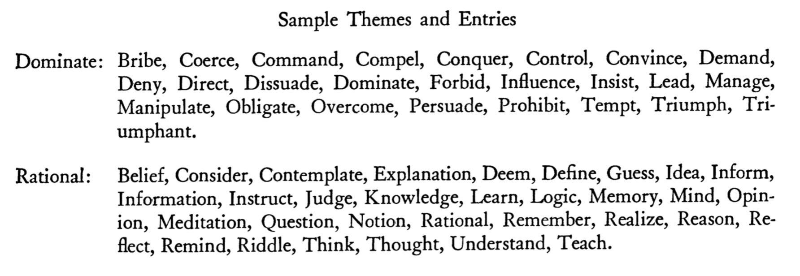
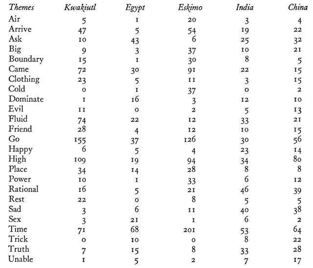
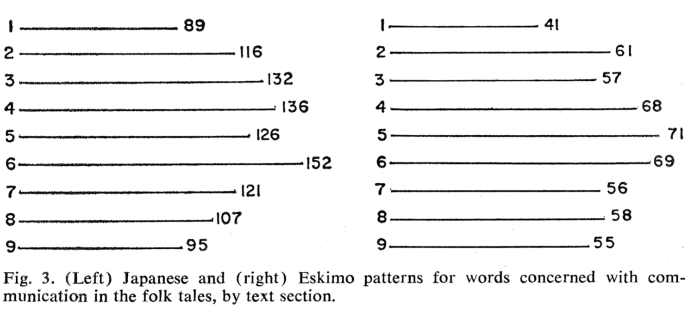
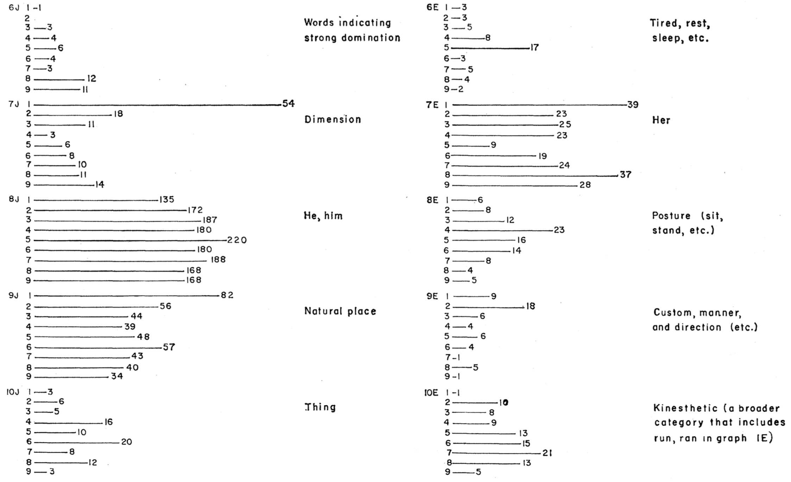
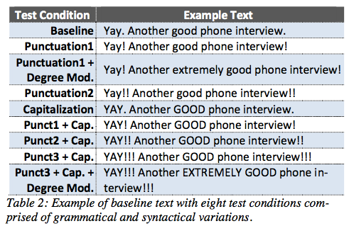

# National Champions {.no-title}

::: {.center}

:::

# Review

- Word embeddings allow us to explore **meanings that exist independently of documents**
  - Documents are a **means to an end**
  - WEs represent **collective representations**
- You can **generate your own** semantic models or **incorporate pre-trained models**
  - Like topic models, they use documents to generate representations that transcend documents
  - Pre-trained models **should align** with your corpus
- There are many ways to generate WEs
  - In principle, the logic **applies to other things**, e.g. proteins, social groups

# Overview

- So far, we have been focused on **cognitive content**
  - Mental maps, topics, word meanings
- But $Culture = Ethos + Worldview$
  - **Worldview**: categories, theories, "world hypotheses"
  - **Ethos**: values, norms, sentiments (*toward* things)
  - The two are closely related and hard to disentangle
- The branch of text analytics concerned with *ethos* is Sentiment Analysis (SA)

# Ethos and Worldview {.no-title}

::: {.columns}
::: {.column width="40%"}
<br/><br/><br/>
[Dante's *Divine Comedy* describes a worldview that is also and ethical system]{style="text-align:left;"}
:::
::: {.column width="60%"}

:::
:::

# Overview {.assertion}

Also, instead of a **class of technical methods**, SA refers to a **general problem domain** with many approaches

SA usually has specific empirical goals in mind

# What is Sentiment Analysis?

- SA is a branch of text analytics concerned with **inferring evaluative content** from textual data
  - "Sentiment" is a cover term for **values, opinions, emotions, attitudes**, etc.  (elements of *ethos*)
  - In general, the **positive or negative orientation of people toward things**
- Need not be binomial (like/dislike)
  - Some SA methods look for intensities of **different emotions**  
- Part of a broader and much older branch of TA called **content analysis**
  - Related also to **Qualitative Data Analysis** and **semantic markup**
  - Same principle: identify words that signify something
- A pervasive and essential tool
  - BTW, **Facebook's "like" feature** is essentially a way to for people to label content by sentiment

# Uses of SA

- **Brand sentiment** for marketing (or anything else)
  - Do people like our product? Our candidate?
- **Population mood** or tone
  - National consciousness (Mishne and Glance 2006)
  - Stock market (Bollen, et al., 2011)
  - Geography of happiness (Mitchell, et al., 2013)
- **Opinion mining**
  - Some argue it is better than polling
- **Narrative patterns**
  - Sentiment patterns within texts

# Sentiment as Signal {.center}



[Leetaru 2011](https://firstmonday.org/article/view/3663/3040)

# Sentiment as Signal (ii) {.center .no-title}

::: {.columns}


[Mitchell, Frank, et al., 2014 ](https://journals.plos.org/plosone/article?id=10.1371/journal.pone.0064417)
:::

# Text as Sensor {.assertion}

Texts are like **sensors**

They are  **transducers** of cultural and social information

# Methods of SA

- Lexicon-based
  - **General Inquirer**
  - LIWC ("Luke") -- Linguistic Inquiry and Word Count
  - NRC Word-Emotion Association Lexicon (aka EmoLex)
- ML-based approaches
  - Supervised, Unsupervised, Semi-supervised (Naive Bayes, Maximum Entropy, Support Vector Machines, etc.)
- Rules-based
  - **VADER**: **V**alence **A**ware **D**ictionary for s**E**ntiment **R**easoning
- Enhanced Lexicon
  - Hu and Liu, Ensemble Classification

# Lexicon {.assertion}

A lexicon is **a kind of dictionary** in which words are **glossed** as features

Features may include **ontological categories** and **numeric properties**

In our data model, a lexicon is an extension of the **vocabulary table** and an ontology might be added as **another table**

Lexicons are usually **human-generated**

# Sentiment Lexicons

- **Polarity-based**
  - LIWC, General Inquirer (GI)
    - Typically, these lexicons cover more than sentiment
    - SA uses two categories (positive/negative) from larger lexicon
  - They assign positive or negative value based on context free meanings ("semantic orientation")
- **Valence-based**
  - ANEW, SentiWordNet, SenticNet
  - Assign a valence, or magnitude

# General Method

- Get a **BOW model** of a corpus
- **Tag words** that match terms in the lexicon
  - Can be done with an inner join between tokens and vocabulary
  - Words inherit the polarity and intensity from the lexical entry
- **Score each document** by some function
  - majority voting, averaging, thresholding, counting
- Enhanced methods include more features and heuristics

# The General Inquirer (GI)

- The General Inquirer System is one of the oldest SA tools
  - Developed at **Harvard** University in **1961** by Philip J. Stone, Robert F. Bales, et al.
- Developed for **content analysis** research problems in the **behavioral sciences**
  - In 1962 it merged with the **Hunt Concept Learner** to produce a method for **automatic theme analysis**
  - Research was intended to discover how humans learn to classify things
- Even though crude by today's standards, it demonstrates the **fundamental design principles** of sentiment analysis 
  - And it's still around -- see [GI homepage](http://www.wjh.harvard.edu/~inquirer/)
- See https://www.joe.org/joe/2001december/tt1.php

# GI Book {.no-title}



[On sale at Amazon for `$1,497.32`]{style="font-size:90%;"}

# The IBM 7090 {.no-title}

::: {.columns}
:::::: {.column width="40%"}
- Developed using what was then a the state-fo-the-art **IBM 7090**
  - One of IBM's first transistor-based (solid state) computers
- Designed for NASA's Mercury and Gemini space missions
  - The computer in _Hidden Figures_ that **Dorothy Vaughn**, supervisor of human computers, learned to use.
::::::
:::::: {.column width="60%"}

::::::
:::

# Dorothy Vaughan {.no-title .center}

::: {.column height="700px"}

:::

# Colby's Research

- The cultural anthropologist **Benjamin Colby** applied the GI system to **folklore**
  - Anthropologists often study **myths**
  - Folklore is a variant of myth (so-called "fairy tales")
- Goals is to observe and **represent thematic content**
  - "Clusters of such themes provide insight into the way cultures conceptually organize the world around them."
- Does a **comparative study** of five cultures
  - Kwaikiutl, Egypt, Eskimo, Hindu India, and China  

# Colby Quote  {.no-title}

> "Only very recently has  it become possible, through the use of computers, to process large numbers of narrative texts having many variables in order to discover statistically significant patterns which are culturally distinctive and amenable to testing in the field."
>
> Colby 1966: 793

# GI Data Model

- A **dictionary** containing:
  - A. **High frequency** words of **low information** content (i.e. stopwords)
  - B. **Medium frequency** words with **multiple meanings** and are therefore ambiguous out of context (e.g., 'content' 'general')
  - C. **Words with single predominating meanings**
- A corpus of **texts** containing:
  - Folktakes with 9000 words per cultural sample
  - Dictionary groups A and B removed
- An **lexicon** of words mapped onto **themes**
  - Based on existing work, e.g. Harvard's IV-4 dictionary and the [Lasswell Value Dictionary](http://www.wjh.harvard.edu/~inquirer/lasswell.htm)
  - **180 themes** used to classify type C words
  - **8 Groups**: *Value categories, perception and communication, space and time, self-identity, nature, sex and kinship, activities, miscellaneous*

# Themes

- In addition to the GI themes, Colby incorporates the anthropologist's **Clyde Kluckhohn's monumental study of culture**
  - He defined a set of **core oppositions** with which to "score" cultures
    - E.g. `Self-Other, Good-Evil, Individual-Group, Emotional-Rational, Quality-Quantity`
    - Today, we would call these **ontological** 
    - Kluckhohn's approach consistent with idea that **cultural systems of classification are built out of oppositions**
  - Colby reduces these to a smaller set of less general, more precises themes
    - See samples ...

# Use of Ontologies {.assertion}

Note that today we use **ontologies to define features** in machine learning

# Sample Themes {.no-title}



# GI Algorithm

- After removing stopwords and polyemous words, each word in each cultural sample is **tagged** with its corresponding category in the thesaurus
- The tags are **tallied** into counts for each culture
- Counts are **evaluated** by frequency, clustering, and correlations, both within and between samples

# GI Results {.no-title}



# GI Interpretation

- **[Kwaikiutl and Eskimo]{.small-caps}** 
  - Both have very high count for categories **Arrive, Go, and Place**, reflecting a concern with travel, exploration, distance, and territory
  - Clearly differentiated from the other three cultures in this
  - May reflect the similarity in geographical situation
- **[Eskimo]{.small-caps}**
  - High scores for the themes **Aware, Form, See, Smell, Texture**, etc.
  - This cluster of themes connected with **sensory perception** 
  - Relates to ecological adaptation of the Eskimo to a harsh environment
  - Also high counts for weather themes  suggest importance of ecological adaptation

# GI Interpretation (ii)

- **[Egyptian]{.small-caps}**
  - Co-occurrence of high counts for **Dominate, Follow, Ask**
  - Suggests importance of social participation, submission to power and authority
  - High count also given **Independence** may indicate a simultaneous value emphasis upon autonomy and self-sufficiency
- **[India and China]{.small-caps}** 
  - High counts for both **affective and rational themes**
  - Contradicts preconceived ideas about the complementarity of these themes
    - (Americans, at least in the Enlightenment tradition, tend to separate reason and emotion)
  - Shows the heuristic value of computer work

# GI Interpretation (iii)

- The themes **Boundary, Form, Time, and Hunt** form a **covariant cluster** 
  - If a culture's tales strongly emphasize one of the member themes, they will also strongly emphasize the others
    - Conversely, weak emphasis of one theme is accompanied by weak emphasis of the others
  - Colby speculates that these themes may have a **"cognitive interrelationship which transcends cultural differences."**
    - i.e. They may consitute a **cultural universal**
- These results show that the method can discovery  **contrasts that differentiate and characterize cultures**

# Observations {.assertion}

- These kinds of observations seem relevant to the interpretation of words in **our PCA example**
  - The component **loadings** might be mapped onto **ontological categories** like this
- These theme clusters also **look a lot like topics** surfaced by LDA

# Some  Criticisms

- **Translatability** of Class C words. Counter examples:
  - Japan: *on*
  - Brazil: *saudade*
  - Netherlands: *gezellig*
- Removal of **polyemous** terms loses a lot of cultural information
- **Sample bias**
  - Only 9000 words per "culture"!
- **Definition of culture** is notoriously slippery
  - Does India or China have a single culture?

# Culture Patterns in Narrative

- Colby extends his research by **mapping ontological terms onto narrative**
  - Same analytic duality we have seen &mdash; **structure vs. process**
- Also comes up with **a general model of culture**
  - Cultural **templates**

# Culture Pattens Theory

- Anthropologists have long held that culture exhibits **patterns** and **configurations**
- Example configurations: **Apollonian and Dionysian** (Ruth Benedict)
  - *Apollonian*: tradition, prudence, restraint, harmony
  - *Dionysian*: danger, power, violence, self-reliance
  - Similar to Indo-European *Mitra / Varuna* (*celeritas / gravitas*)
- Hypothesis: Word counts (i.e. text analytics) indicate **cultural templates** or pattern components
- Each folktale reflects the influence of a such a template system
  - i.e. A generative model, whereby templates generate texts

# Culture Patterns Method

- Divide folktales into 9 units of equal length
  - 3 = beginning, middle, and end
- Stack tales into composite
  - i.e. Unit number becomes a label
- Focus on **Japanese** and **Eskimo** folktales
  - In translation
- **Tally** thesaurus terms for each unit **across** folktales

# Some Observations

- When data from both cultures are viewed together, time and place words appear disproprtionately in Part 1 
  - These are related to the situating function
- However, when look at individually, time and space have different distributions

# Time


# Space and "Search"

- In terms  of space, the category "**search**" is distributed differently in each corpus
- Search appears early in Eskimo texts
  - Implies searching for game (**hunting**)
  - **Decreases** as story proceeds (as these activities tend to be interrupted)
- Search appears later in Japanese texts
  - Searches are for **secrets**, hidden things, special places
  - **Increases** with narrative time
- In other words, search involves **different things**
  - Principle of **context** -- same words, different context, different meaning

# Communication



# Culturally Significant Differences

- 10 most significant contrasts  betwen distributions established by Chi Square and Kendall's Tau tests
  - Not described :-(
- Out of 74 basic categories and 195 subcategories
  - Japanese -- 55 tales (22%) considered distinct
  - Eskimo -- 70 tales (26%)

# Colby 1996 Fig 1a {.no-title}


Ten most significant patterns of word-group frequencies (1&mdash;5)

# Colby 1996 Fig 1b {.no-title}



Ten most significant patterns of word-group frequencies (6&mdash;10)

# Some Generalizations {.no-title}

::: {.columns}
::: {.column width="50%"}

**Japanese Culture**

Externally oriented, concern with social things

material objects

limitatins due to domination

impersonal divine justice

social situations

nuclear family

:::
::: {.column width="50%"}

**Eskimo Culture**

Concern with physical abilities, individually oriented

physical actions

limitations due to strength

magic

survival

extended family
:::
:::

# Criticisms and Observations

- Distributions based on **small samples**
- Cultural **generalization** from small sample
  - May be suitable for characterized collections and subcollections of texts
- Sensitive to ontologies?

# Cultural Templates {.no-title}


# Typical Problems with Content and Sentiment Analysis

- Limited vocabularies
- Assumed monosemy
- Do not include grammar, syntax, punctuation, emoticons
- Can't catch irony, sarcasm
- Can't detect context, which can shift meanins (e.g. "large")

# VADER

- A relatively recent SA tool developed to overcome these limitations
  - Although designed for social media, is generalizable
  - Combines existing lexicons and employs a hybrid apprach to achieve good performance
- Design
  - 7500 lexical features
  - Polarity
  - Intensity [-4, +4]
  - Gold-standard list
  - Uses heuristics to define text characteristics (e.g. punctutation, emoticons, all caps)
  - **Applies to sentences**
- Implemented in NLTK

# VADER Flow {.no-title}


# VADER Example {.no-title}



# VADER Example

```text
VADER is smart, handsome, and funny. 
	{'pos': 0.746, 'compound': 0.8316, 'neu': 0.254, 'neg': 0.0}
VADER is smart, handsome, and funny! 
	{'pos': 0.752, 'compound': 0.8439, 'neu': 0.248, 'neg': 0.0}
VADER is very smart, handsome, and funny. 
	{'pos': 0.701, 'compound': 0.8545, 'neu': 0.299, 'neg': 0.0}
VADER is VERY SMART, handsome, and FUNNY. 
	{'pos': 0.754, 'compound': 0.9227, 'neu': 0.246, 'neg': 0.0}
VADER is VERY SMART, handsome, and FUNNY!!! 
	{'pos': 0.767, 'compound': 0.9342, 'neu': 0.233, 'neg': 0.0}
VADER is VERY SMART, uber handsome, and FRIGGIN FUNNY!!! 
	{'pos': 0.706, 'compound': 0.9469, 'neu': 0.294, 'neg': 0.0}
VADER is not smart, handsome, nor funny. 
	{'pos': 0.0, 'compound': -0.7424, 'neu': 0.354, 'neg': 0.646}
```

# Compounds Scores

- The compound score is computed by summing the valence scores of each word in the lexicon, adjusting according to the rules, and then normalizing between -1 (most extreme negative) and +1 (most extreme positive) 
  - Most useful metric for single unidimensional measure of sentiment for a given sentence
  -'normalized, weighted composite score'

# Thresholds

- To classify sentences as either positive, neutral, or negative, use:
  - positive sentiment: `compound score >= 0.05`
  - neutral sentiment: `(compound score > -0.05) and (compound score < 0.05)`
  - negative sentiment: `compound score <= -0.05`
- The pos, neu, and neg scores are ratios for proportions of text that fall in each category
  - These should all add up to be 1
  - These are the most useful metrics if you want multidimensional measures of sentiment for a given sentence.

# Lexicon-based Ensemble Classification Sentiment Analysis

- Efficient method for counting **sentiment orientation**
- Solves the **problem of context**
- Outperforms supervised learning approaches in time and memory complexity without sacrificing accuracy
- Generates unigram, bigram and trigram lexicons 

# Frequentiment

- Employs **"frequentiment"**
  - Based on frequency of features (words) in the document 
  - Averages their impact on the sentiment score compared to documents without these features
  - Eensemble classification then used to improve the overall accuracy
  - Outperform other popular lexicons and some supervised learners 
  - 3–5 times faster than the supervised approach 
- One of the most comprehensive comparisons of domain sentiment analysis in the literature.

# NRC Word-Emotion Association Lexicon (aka EmoLex)

- 4,182 unigrams (words)
- English words
- General domain; common words
- Manually annotatied by crowdsourcing on Amazon Mechanical Turk (AMT)
- sentiments: negative, positive 
  - 0 (not associated) or 1 (associated)	
- emotions: anger, anticipation, disgust, fear, joy, sadness, surprise, trust	
  - not associated, weakly, moderately, or strongly associated
- URL: [http://saifmohammad.com/WebPages/NRC-Emotion-Lexicon.htm](http://saifmohammad.com/WebPages/NRC-Emotion-Lexicon.htm)