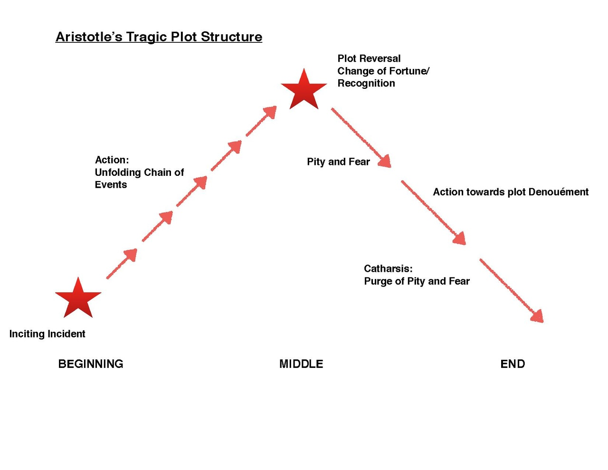

# Business

- MALLET not required for topic modeling
- You can use SKLearn to create TFIDF matrix if your corpus is large
  - But realize that it does not let you filter for Part of Speech, etc.

# Review

- **Sentiment Analysis** a specific case of **content analysis**
  - `Sentiment` just one category among many
  - Other emotions and categories may be described
- Standard SA methods are **lexical** 
  - The General Inquirer is the prototype
  - Dictionaries of terms glossed as having sentiment
- Typical sentiment **measures**:
  - *Polarity*: -1 or 1
  - *Valence*: float between positive and negative endpoints
- **Advanced** SA tools work at **sentence level**
  - Considers grammar, POS, preceding ngrams, punctuation
  - [Stanford's SA tool](https://nlp.stanford.edu/sentiment/index.html) uses a recursive neural network that uses grammatical structures

# Definitive Text {.no-title}

::: {.column .float-left}

:::

::: {.column .align-left}
- Comprehensive introduction and survey of field
- Access at [home page](http://www.cs.uic.edu/~liub/FBS/SentimentAnalysis-and-OpinionMining.html)
- Download [Free PDF of draft](http://www.cs.uic.edu/~liub/FBS/SentimentAnalysis-and-OpinionMining.pdf)
- Download [opinion Lexicons](https://www.cs.uic.edu/~liub/FBS/sentiment-analysis.html#lexicon)
:::

# NRC Sentiment and Emotion Lexicons

- Created by experts at the National Research Council of Canada
  - Can be used in sentiment analysis, product marketing, consumer behavior, political campaign analysis, etc.
  - In addition to words **includes hashtags, emoticons and word-colour associations**
  - English, but includes **translations** into 105 other languages, including French, Arabic, Chinese, and Spanish
- Includes **sentiment and emotion**
  - See next slide
- Download [lexicons](http://sentiment.nrc.ca/lexicons-for-research/)

# Sentiment and Emotion

- Sentiment and emotion are related but different concepts
- **Sentiment** refers to a **general** positive or negative attitude toward something
  - Attraction or repulsion
- **Emotion** refers to the presence of **specific** emotions  
  - Joy, Fear, etc.

# Narrative 

- Today we look at the application of SA to **the study of narrative**
  - We have already seen a version of this in McClure's mental maps
- An essential feature of some texts is their **narrative quality**
  - Narrative is **a reduced representation of human behavior**, aka social action or life
- Every novel is **a theory of human behavior**
  - Narratives express that theory using fictional characters
  - But the logic of their behavior, and the description of how life unfolds, these are expressions of an author's worldview

# The Study of Narrative {.no-title}

::: {.column .float-left}
- Aristotle's *Poetics* presents **a theory of tragedy** (drama)
- A key concept is the idea of **action** or plot
- This is the unfolding of events in a story or play, considered the **soul** of a story or play
:::

::: {.column}

:::

#  Dramatic Action {.no-title}

# Vonnegut

- The American writier Kurt Vonnegut argued that **stories have shapes** which can be "drawn on graph paper"
  - Similar to Aristotle, but comparative: the shape of a society’s stories is "at least as interesting as the shape of its pots or spearheads"
  - Vonnegut studied anthropology
- See [video](https://youtu.be/oP3c1h8v2ZQ)

# Four Shapes {.center}

X = time, Y = fortune

#  Fortune {.assertion}

A key idea that can be overlooked is that both Aristotle and Vonnegut underline the relationship between narrative and **destiny**

Destiny is a central concept in the study of culture

Different cultures have different ideas about it

*luck, fate, destiny,  providence, doom, history, evolution, randomness*

# Matt Jockers

- **Matt Jockers** Developed a software package and method for studying narrative computationally called **Syuzhet**
  - Written in R and available [here](https://github.com/mjockers/syuzhet)
  -  Matt is Professor of English and Data Analytics at Washington State University (formerly at Stanford and Nebraska)
- Applies sentiment analysis to the study of narrative
  - Based on idea that **fluctuations in sentiment are proxies for fluctuations in plot movement**

# Syuzhet {.no-title}

- **Syuzhet** comes from the Russian Formalists Victor **Shklovsky** and Vladimir **Propp** 
  - Propp famous for theory of the **folktale** as **sequence of functions**
- They  argued that narrative has two parts: "fabula" and the "syuzhet" 
  - **Fabula**: The elements of a story, including actual chronological order
  - **Syuzhet** The manner in which the elements of the story (fabula) are organized or "told" 
- Syuzhet sometimes called **plot order**

# Memento {.no-title}

# Plots by Sentiment {.assertion}

The basic idea is show the distribution of **sentiment markers** over **narrative time**

# Annotated *Portrait* {.no-title}

# The Picture of Dorian Gray (Wilde) {.center}

> Dorian’s life takes a dark turn as the reality of the portrait becomes apparent.

# The Da Vinci Code (Brown)  {.center}

> Dan Brown never lets the plot become too troubled or too much of a downer. He baits us and teases us with fluctuating emotion.

# Blood Meridian (McCarthy)  {.center}

> Blood Meridian is a dark book and the more generalized blue trend line lingers in the realms of negative emotion throughout the text; it is a very different book from The Da Vinci Code.

# Hypothesis and Questions

1.  Gvien that fluctuations in sentiment are a proxy for fluctuations in plot movement
2. And that there are a **finite number of plots**
   - Estimates range from 3 to 36 
   - See Booker 2004, Foster-Harris 1959, Tobias 1993, and [Polti 1916](https://en.wikipedia.org/wiki/The_Thirty-Six_Dramatic_Situations).
3. **How many** plots are there?
4. Can we develop a **typology** of plots? 

# Approach {.assertion}

Generate plots for [**a corpus of 41,383 novels**](http://www.matthewjockers.net/2013/02/20/unfolding-the-novel/)

**Normalize plots** so that they can be compared

Call these normalized plots **foundation shapes**

# Method {.assertion}

So, to pursue these questions, we need a way to normalize the plots of many novels

# The Problem of Text Length

- A **problem** immediately arises: 
  - How to compare **texts of different lengths**?
- If we follow **Colby’s method** of dividing each story by the same number of units (but for, say, 100 chunks), **some chunks will be larger**
  - The larger the chunk, the more chance for **wash-out**
  - We know that books as a whole tend to have a **mean valence close to zero** on a scale of -1 to 1
- A solution
  - Use **Fourier transforms**

# Fourier Transforms

- Fourier transforms are method from **signal processing** that decomposes signals in component wave forms
  - We say that the **time domain** is transformed into the **frequency domain**
- Once transformed, you can **remove unwanted waves**  in the frequency domain and then reconstitute a **cleaner signal** in the time domain
- This provides a way of transforming the sentiment-based plot trajectories into a form **independent of story length**
  - We can move from plot domain to sentiment-signal frequency domain back to plot domain

# Fourier Transform Image {.no-title}

# Low Pass Filter

- A **low-pass filter** is be used to remove the background “hiss” in an audio recording
  - A similar approach can be used to filter out the extremes in the sentiment trajectories
- Syuzhet computes **foundation shapes** by **discarding all but the lowest terms of the Fourier transform**

# Foundation Shapes {.center}

# Process

1. **Generate plot shapes** for all books in the corpus
2. Build a **similarity matrix** over all the novels (using Euclidean distance)
3. **Cluster** books by Hierarchical Agglomerative Clustering (Ward?)
4. Try out various methods of cluster identification ([silhouette](http://en.wikipedia.org/wiki/Silhouette_(clustering)), [gap statistic](http://web.stanford.edu/~hastie/Papers/gap.pdf), [elbow](http://en.wikipedia.org/wiki/Determining_the_number_of_clusters_in_a_data_set#The_Elbow_Method)) and develop ad-hoc **cluster identification algorithm**.
5. **Observe** that there are six, or maybe seven, fundamental plot shapes.

# All the Plots {.no-title}

# Results {.no-title}

# Two Major Types {.no-title}

# Subtypes 1 {.no-title}

Subtypes of man in hole  
  

# Subtypes 2 {.no-title}

Subtypes  of man on hill  

# Beyond four, where to cut?

- Iterate through a series of possible cut points
  - For each, take two measures:  
    - **cluster homogeneity**
    - **cluster dissimilarity**
  - compare to objective
- Also apply intuition  :-)

# Choose 6 {.no-title}
Choose 6 -- MIH I and MOH II split (but note lower right)  

# Choose 7 {.no-title}

Choose 7 --  MOH II splits  

# Archetypes {.no-title}

# Archetypes {.no-title}

# Archetypes {.no-title}

# Archetypes {.no-title}

# Archetypes {.no-title}

# Archetypes {.no-title}

# Swofford's Criticisms

- Sentence parsing
  - Not always correct (see Dickens example)
- Sentiment attribution
  - Usual flaws
- Foundation Shapes 
  - **Ringing artifacts** caused by a low-pass filters

> the foundation shape for the first part of the book is not merely inaccurate, but in fact exactly opposite the actual shape of the original graph.

# Sentence Parsing

> Mrs. Rachael, I needn’t inform you who were acquainted with the late Miss Barbary’s affairs, that her means die with her and that this young lady, now her aunt is dead–”
> “My aunt, sir!”
> “It is really of no use carrying on a deception when no object is to be gained by it,” said Mr. Kenge smoothly, “Aunt in fact, though not in law.

# Sentiment Attribution

Swofford points out the usual problems:

- Can’t process modifiers
- Polysemy
- Contemporary English
- Repetition discounted
- Lack of nuance

# Example

> I haven’t been sad in a long time.
> I am extremely happy today.
> It’s a good day.
> But suddenly I’m only a little bit happy.
> Then I’m not happy at all.
> In fact, I am now the least happy person on the planet.
> There is no happiness left in me.
> Wait, it’s returned!
> I don’t feel so bad after all!

Common sense would interpret the sentences just the opposite to the graph!

# Foundation Shapes and Ringing Artifacts

- Low-pass filters often introduce **ringing artifacts** -- extra humps in the graph that aren’t well-approximated by sinusoids 
- These artifacts will be larger when the number of sinusoids is lower

#

- By default, Syuzhet uses an even lower cutoff than the example above (keeping only three Fourier terms)
- *The Portrait of the Artist* example shows this

- Until Syuzhet provides filters that don’t cause ringing artifacts, it is likely that most foundation shapes will be inaccurate representations of the stories’ true plot trajectories
-  Gaussian filters do not introduce ringing artifacts, though they have their own limitations 

# Jockers' Response

-  None of the current sentiment detection methods are especially reliable (!) 
  - The Stanford tagger (considered best in the open source market) hovers around 80–83% accuracy
  - Performance sensitive to genre
- No “correct” sentiment
  - Is it close enough?
- Sophisticated tools are not necessarily better

# Comparison 1

# Comparison 2

#  Response to criticism of foundation {.assertion}

 Regarding the criticism that the foundation is wrong, Jockers's asserts that it is actually is consistent with **the novel as read**

# Low Pass = 5

- Could get more accurate

# Remaining problems

- Irony, satire, dark humor, etc.

# Swofford Resonse 2

- Not arguing about whether or not *Portrait of the Artist* represents a “man in a hole” plot shape,
  - The Syuzhet plot shape can easily be the **result of low-pass filter artifacts** instead of a reflection of the computed sentiment
  - Therefore **does not reliably reflect the emotional trajectories of novels**
  - Can’t trust the foundation shapes!
- More important:  **Can't evaluate sentiment analysis as  “good enough”** without benchmarks to define success
- She notes that Jockers’ “proof” elides some differences in the methods...

# Test 1

- Remove the emotion from the last third of the novel and see what the transform does
- The result shows that the last hump is a ringing artifact

In fact, you can just leave the middle twenty sentences (0.5%)!

# Test 2

> Their similar foundation shapes do not validate Syuzhet’s sentiment analysis algorithm; they merely demonstrate that Syuzhet’s foundation shapes can make dissimilar curves similar.

# There’s more

- The new foundation shape (blue) now shows the midpoint of the novel as less negative than the area around it, even though it is still the most negative portion of the story (since we only changed the very beginning and end) 
- Classic ringing artifact: the foundation shape can’t reflect the emotional heights at both ends of the story without altering the middle because the correct shape cannot be approximated by low-frequency sinusoids

# Lepage’s Quartet

# One Signal, Four Shapes

> practically all of the variation is determined by the higher Fourier terms. This means that by making nearly-invisible low-frequency changes to the original valence, we can completely alter its foundation shape:

# In Sum {.no-title}

> All in all, Syuzhet’s lack of benchmarks and inaccurate foundation shapes are cause for concern. It has a long way to go before we can make reliable claims about the number of archetypal plot shapes novels share.

# Jockers’ Response

- Information loss OK [But it’s the accumulation of error that matters]
- Implemented a Gaussian filter, but still unconvinced
  - Remember -- trying to solve the problem of length
- There are no books with zero neutral values for an entire third
- The exercise has more to do with the setting of a particular user parameter than it does with the package.
- Open to the possibility that there is some **confirmation bias possible**

# Playing with the Parameter

# Playing with the Parameter

Still MIH . . .

# Enderle

- Jockers suggests that ringing artifacts are what we want
- Do we want this kind of distortion?
- "My issue with using Fourier transforms to represent sentiment time series data is that we have no clear theoretical justification to do so. We have no theoretical reason to want the kind of distortion it produces."
- [Pace Underwoord] "we should do our best to ensure that the mathematical models we use have clear and concrete interpretations in terms of the physical processes that we study and seek to understand: : reading, writing, textual distribution, influence, and so on. This is what Syuzhet fails to do at the smoothing and filtering stage right now."

# What’s Wrong with Fourier

- A Fourier transform models time series data as a weighted sum of sine waves of different frequencies.
- Why should sentiments be described this way?
- Compare to the Dirichlet prior in LDA -- It’s a set of N distinct real-valued variables that always sum to one. 

# Underwood

- I’m unsure how anyone *could* be right or wrong here, because as far as I can tell there’s no thesis under discussion yet.
- The same thing goes for the concepts of “plot” and “emotional valence.” 
- We need a question we’re trying to solve.

# Schmidt

- Fourier transforms are the wrong “smoothing function” (insofar as that is the appropriate term to use) to choose for plots, because they assume plot arcs are periodic functions in which the beginning must align with the end.

- this cyclicality means that syuzhet imposes an assumption that the start of plot lines up with the end of a plot.

# Schmidt

> this should convince Jockers to retire the waveform assumptions in favor of something like Loess smoothing or moving averages

# Requiem

- Agrees with Schmidt re the edges
- But endpoints are problematic in most smoothers and filters
- With a simple rolling window, for example, the averaging can’t start until we are already half the distance of the window into the sequence.

#  Conclusion {.assertion}

We need a theory of plot

Are sentiments signals?