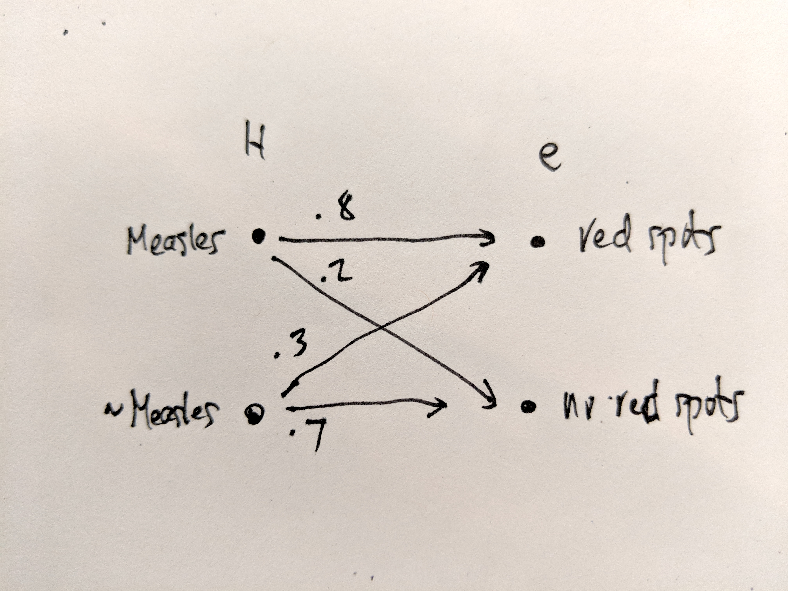
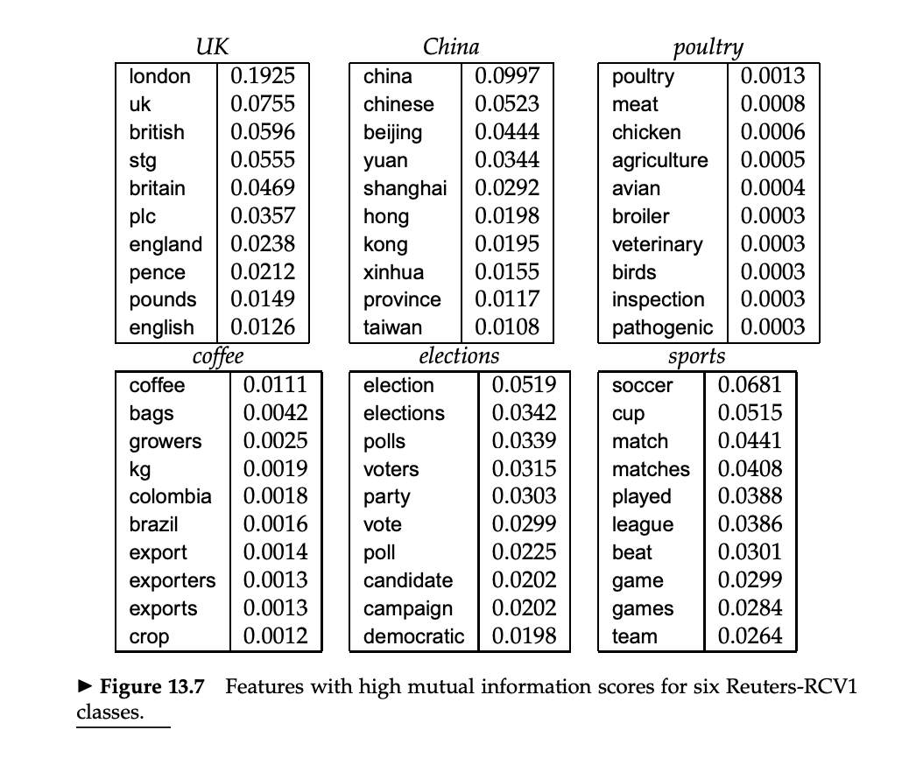

# Business

- **Projects** going OK?
  - Any blockers?
  - We will focus on them next week
- **Quizzes**
  - Still have one more to give! :-)
  - Sorry for the delay; had to travel this weekend

# Review

- Sentiment analysis as a tool to study **narrative**
- Can be applied to **newspapers** as well
  - Functions as **event detection**
  - Application of **time series** methods
- For those in the MSDS, consider applying **Hawkes process** model
  - Linguistic phenomena are **point processes**

# Overview {.assertion}

Today, we turn to **classification**

Specifically, text of **document classificaiton**

Before getting into that, let's **situate** our subject

# Machine Learning and AI {.assertion}

**Document classification** is a species of **classification**

Classificaiton is a branch of **machine learning**

Machine learning is a branch of **AI** (historically)

# Machine Learning and AI


From [Credera](https://www.credera.com/blog/technology-solutions/machine-learning-essentials/)

# Machine Learning Image {.no-title}


See [Machine Learning for Everyone](https://vas3k.com/blog/machine_learning/)

# Machine Learning Image {.no-title}


# Classification

- Classification refers to the task of **predicting the category** of a thing when **the use** of the category on similar things **is known**
  - Categories are also called classes, labels, and annotations
  - Prediction based on **learning the rules** that govern the application of the label by humans
- Traditional AI sought to develop a **deductive system** of rules
  - The goal was to develop encyclopaedic knowledge of the world within which inferences can be mechanically drawn
  - The ancient dream of logic
- Machine learning applied more **"brute force" methods** to learn rules statistically
  - Inductive approach
  - Instead of rules, we **learn statistical models**
  - These models may or may not be **interpretable**

# Classification and Inference

- **Inductive inference**
  - Learning a rule from data, and then applying that rule to other data
  - Deduction = working within rules alone (e.g. theorems)
  - Many forms of inference, including *abduction*
- **Inference** and **prediction** often constrasted
  - Inference = science
  - Predicton = decision-making

#  A More Formal Definition

- Formal definition
  - $\textbf{y}$: A vector (column) of **labels**
    - What you are trying to predict
  - $\textbf{X}$: A matrix of **feature** vectors (rows, each $\textbf{x}$)
    - The information you have
    - Each vector element a member of a domain (column)
  - $\hat{y}$ is the symbol for the guessed or predicted value of $\textbf{y}$
- Many synonyms for $X$ and  $\textbf{y}$
  - treatment / response, feature / label, cause / effect, etc.
- Represented in a **dataframe**
  - **Observations** = **$(x_{1i}, x_{2i}, ..., x_{ji})$** and $y_i$ (and $\hat{y}_i$ too) 

# Document Classification

- $\textbf{x}$ is $d$ (for a document) 
- $\textbf{y}$ is $C$ (for the classes)
  - $C = \{c_1, c_2, ..., c_j\}$
  - The features are often word counts
- $m$ stands for a set of labeled documents 
  - $(d_1,c_1),...,(d_m,c_m)$
- $V$ often used for the vocabulary of word types
  - Although $w$ is often used for the word instance (i.e. the token)
- In addition, the position of the token is referenced by the subfix $i$, as in $w_i$

# Some Text Classification Tasks

- Spam detection
- Language identification
- Subject grouping
- Genre detection
- Author attribution
- Etc.

# Standard Machine Classifiers for Document Classification

- Linear Regression
- Logistic Regression
- Support Vector Machines (SVMs)
- **Naive Bayes**
- Decision Trees and Random Forests
- Neural Networks

# The Machine Learning Pipeline


# Text Analytic Specific

- **Data Preparation**
  - **Data wrangling** means conversion into text data model and then **analytical format** of features and response variable
  - Often, this is a **bag-of-words** representation
  - Feature selection may involve **TFIDF** or even **SVD**
  - **Expected Mutual Information**, based on contribution of feature to prediction
- **Modeling**
  - Choice of **model** and implementation **algorithm**
  - **Splitting** into training and testing subsets
  - May include further division of training set into training and **held-out dev set** for paramater tuning
- Performance and Evaluation
  - **Recall**, **Precision**, and **F-score**

# Text Analytic Specific (cont'd)

- **Significance Testing**
  - **Traditional statistical methods aren't used** (e.g. p-values) because performance test results are non-Gaussian
  - Instead, we use non-parametric methods such as **bootstrapping**
- **Interpretation**
  - Application of domain knowledge, user feedback, etc.

# The Document Classification Problem

- Can be understood as a problem in **Bayesian inference**. You are trying to estimate 
$$
P(C|d)
$$
- That is, for document $d$ out of all classes $c \in C$, find the class $c$ Maximum A Posteriori value
$$
\hat{c} = \text{arg} \text{max} P(c_i|d)
$$

- Naive Bayes provides a method based on this idea

# Naive Bayes (NB)

- **Generative** 
	- In contrast to discriminate classifiers like logistic regression
	- Discriminative classifiers are more accurate and thus more common
	- Generative still have a role
- **Ptobabilistic**
	- Assigns a float between 0 and 1
- **Peformant**
  - Not always the best performer, but very fast and easy to implement
  - Used as a baseline
- Why is it called **naive**?
	- Because of the independence assumption (more below)

# Bayes' Theorem: Derivation

$$
P(a,b) = P(a)P(b|a)
$$
$$
P(b,a) = P(b)P(a|b)
$$
$$
P(a,b) = P(b,a)
$$
$$
P(a)P(b|a) = P(b)P(a|b)
$$
$$
P(a|b) =  \dfrac{P(a)P(b|a)}{P(b)}
$$

# Bayes' Theorem: Elements

$$
P(a|b) =  \dfrac{P(a)P(b|a)}{P(b)}
$$

- $a$: Cause, Hypothesis, Model 
- $b$: Effect, Evidence, Data 
- $P(a)$: The Prior  
- $P(b|a)$: The Likelihood
- $P(a|b)$: The Posterior  
- $P(b)$: Normalizing constant (often drops out; also often unknowable)

# Philosophical Aside

- There is a directionality implied by Bayes' theorem
  - $a$ causes $b$
- $b$ must be a member of disjoint and exhaustive set of possible outcomes ($B$)
	- $P(B)$ sums to 1
- Note that $A$ does not sum to one
  - Each is drawn from a differenct distribution

# Arrow of Information {.no-title}



# Pearl on Likelihood


# Bayes' Theorem vs Rule 

- Note that Bayes' **Theorem** and Bayes' **Rule** are not the same
- Bayes' Rule refers to the ability to drop out the denominator when comparing hypotheses:
$$
\dfrac{P(H_1|e)}{P(H_2|e)} = \dfrac{P(H_1)P(e|H_1)}{P(H_2)P(e|H_2)}
$$

# Bayes Appled to Text

- Applied to problem of predicting the class of a text, we have:

$$
\hat{c} = \underset{c \in C}{\arg\max} \dfrac{P(c)P(d|c)}{P(d)}
$$

- Since $P(d)$ is common to all $C$, we can simplify:

$$
\hat{c} = \underset{c \in C}{\arg\max} P(c)P(d|c)
$$

- Now, $d$ is just a joint distribution of features (words), so:

$$
d = (f_1, f_2, f_3, ..., f_n)
$$

- And so we can rewrite our formula as:

$$
\hat{c} =  \underset{c \in C}{\arg\max} P(c)P(f_1, f_2, f_3, ..., f_n|c)
$$

# Being Naive

- Now, the resulting likelihood becomes:

$P(f_1, f_2, f_3, ..., f_n|c) = P(f_1)P(f_2|f_1)P(f_3|f_1,f_2) ... P(f_n|f_1,..,f_{n-1}|c)$

- But this is too hard to compute. So we employ the **"naive" assumption** -- which we saw earlier in creating an ngram model -- that each feature is **independent** of the others:

$P(f_1, f_2, f_3, ..., f_n|c) = P(f_1|c)P(f_2|c)P(f_3|c) ... P(f_n|c)$

- Which we can express compactly as:

$P(d|c) = \prod_{n=1}^{N} P(f_n|c)$

- And so:

$c_{NB} = \underset{c \in C}{\arg\max} P(c)\prod_{n=1}^{N} P(f_n|c)$

# Applying to the corpus

- In terms of our of corpus model:

$$
c_{NB} = \arg\max P(c)\prod_{id=1}^{id_{max}} P(token_{id}|c)
$$

- Since sums of logs are easier to compute than products, we can do this:

$$
c_{NB} = \arg\max \log{P(c)} + \sum_{id=1}^{id_{max}} \log{P(token_{id}|c)}
$$

# The Arrow of Information in Texts

```graphviz
digraph G {
    

}
```

# Training the Classifier

- We estimate the probabilities in our formula by using Maximum Likelihood Estimation (MLE)
  - i.e. by using frequencies as proxies for probabilities.
- So, to **estimate the prior**, $P(c)$, we count the number of documents in our training set with the class and divide by the total number documents:

$$
\hat{P}(c) = \dfrac{N_{c}}{N_{d}}
$$

- sAnd to **estimate our likelihood**, $P(f_i|c)$, we count the frequency of $w_i$ in all documents classified as $c$:

$$
\hat{P}(w_i|c) = \dfrac{count(w_i,c)}{\sum_{w \in V} count(w,c)}
$$

# Word Problems 1

- What about words in the test set that are **in one class but not in the other(s)**?
  -  They have a probability of $0$ for the class they don't appear in
     -  Thus they will make the document have a probability of $0$ for that class
  -  Consider the case of a word used ironically in the test set ...
- To fix, we apply **LaPlace "add 1" smoothing**:

$$
\hat{P}(w_i|c) = \dfrac{count(w_i,c)+1}{\sum_{w \in V} (count(w,c)+1)} = \dfrac{count(w_i,c)+1}{(\sum_{w \in V} count(w,c))+|V|} 
$$

- Note that $V$ stands for the set of all words, i.e. in all classes.
  - This would not matter, except we need to account for words in the test set not found in training.

# Word Problems 2

- What about **unknown words**
  - Words not in the training set at all
- The accepted solution is to **ignore them**
  - We don't include them in the probability function during testing or application
  - Harsh, yet effective :-)

# Stop Words

- It turns out that removing stop words **does not improve performance**
- So, we can **leave them** in the training set
- Keeping them out might improve **compute speed** slightly, though
- Not sure about **keeping only TFIDF** significant words, though ...

# Naive Bayes as Language Model

- To the extent the NB classifiers use only words, they are effectively based on **language models for each class**
  - A Bayes model is a set of class-specific unigram language models
  - A language model is the set of likelihoods for each word given a class
  - Just as LDA creates language models for each topic
- We can use the likelihoods to assign probabilities to sentences
$$
P(s|c) = \prod_{i \in positions} P(w_i|c)
$$
- This confirms Pearl's point about likelihoods
  - The likelihoods in our model language models
  - They are the building blocks of our model of language
  - They have a certain independence of the text, like language models

# Feature Selection



See Manning, et al. 2008

# Model Performance Evaluation

- We evaluate the performance of our model by comparing the results of our predictions on the test set with the actual labels in that set
- These labels are called **gold standard** labels or **ground truth** labels
- These results are usually represented in a **contingency table** or **confusion matrix**

# Results {.no-title}


# Contingency Tables


# Precision, Recall, and F-Measure

- In text analytics, we are mainly concerned with precision and recall
- **Precision** measures the percentage of the items that the were labeled as positive that are positive according to the human gold labels.
  - TP / TP + FP
- **Recall** measures the percentage of items actually present in the input that were correctly labeled.
  - TP / TP + FN
- **F-meausre** = the harmonic mean of the two
  - See below
  - Necessary because it's easy to fool each measure in isolation
- **Accuracy** = (TP + TN) / ALL

# Sensitity vs. Precision

Why is precision sometimes called **sensitivity**?


Used in medicine because: "A doctor can tell a patient if they’re pregnant or not or if they have cancer. Each decision may have grave consequences and thus **true negatives are crucial**. That’s why all the cells in the confusion matrix must be taken into account."


Used in Information retrieval $\therefore$ text analytics because: "A search engine **only cares about the results it shows you**. Are they relevant (TP) or are they spam (FP)? Did it miss any relevant results (FN)? The ocean of ignored (TN) results shouldn’t affect how good or bad a search algorithm is. That’s why true negatives can be ignored."

# Performance Metrics as Probabilities

$P = 1$  

$N = 0$  

$\pi: predicted \in \{0,1\}$  

$\alpha: actual \in \{0,1\}$  

$T: p(\alpha = \pi) = T_0 + T_1$  

$F: p(\alpha \not= \pi) = F_0 + F_1$

$TP = T_1 = p(\alpha=1, \pi=1)$

$TN = T_0 = p(\alpha=0, \pi=0)$  

$FP = F_1 = p(\alpha=0, \pi=1)$  

$FN = F_0 = p(\alpha=1, \pi=0)$  

# Metrics as Probabilities {.no-title}

**Sensitivity or Recall (TPR)**
$$
p(\pi=1|\alpha=1)
$$

**Specificity (TNR)**  
$$
p(\pi=0|\alpha=0)
$$  


**Precision (PPV)**  
$$
p(\alpha=1|\pi=1)
$$

# Metrics as Probabilities {.no-title}

**Accuracy**:
$$
\text{ACC} = \dfrac{T}{T + F} = \dfrac{p(\alpha = \pi)}{p(\alpha=\pi) + p(\alpha\not=\pi)}
$$

**Balanced Accuracy:**
$$
\text{BA} = \dfrac{R(T_0)+R(T_1)}{2} = \dfrac{p(\pi=0|\alpha=0) + p(\pi=1|\alpha=1)}{2}
$$

**F-Score:**
$$
\text{F}_\beta = \dfrac{(\beta^2 + 1)PR}{\beta^2(P+R)} \\
$$

$$
\text{F}_1 = \dfrac{2PR}{P+R} \\
$$

#  Sentiment Analysis Optimization Hacks

# Hack 1

- Counts don't matter as much as presence or absence in a document, so just count  once per document
  - Called **Binary NB**
- Remove duplicate words
  - Or just convert count column in BOW dataframe to `bool` then `int`

# Hack 2

- To handle negation -- cases where words are negated -- add a `not_` prefix to words that follow  a negation word, up to the end of a sentence
  - `didn't like this movie, but I` 
  - becomes 
  - `didnt NOT_like NOT_this NOT_movie,  but I`
- Do this during preprocessing, effectively creating new words

# Hack 3

- Use a **lexicon** to define sentiment in training and test sets
- Use just positive and negative terms in the NB equation
- Useful when we have **little training data**, data is sparse, or test and training sets are divergent
- Seems like cheating, tho

# Hack 4

-  In spam detection, use **para-linguitic features**
   -  All caps in subject line
   -  Mention of large sums of money
   -  Contains other tell-tale phrases

# Hack 5

- In language ID, use byte and character ngrams
  - Distinctive character sequences
- Also train on mulitlingual (e.g. Wikipedia) and geocoded (e.g. Twitter) corpora
