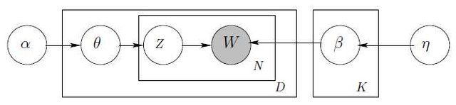
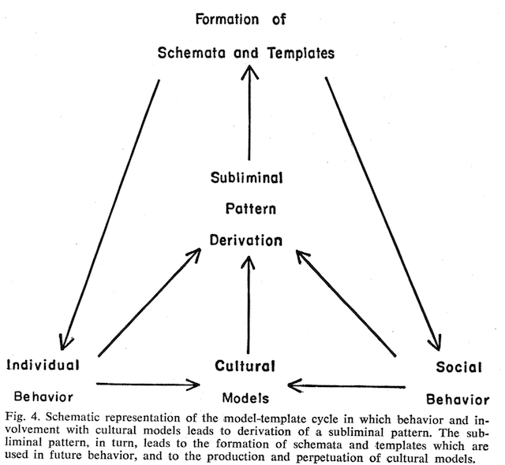
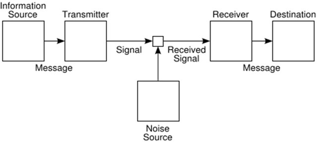
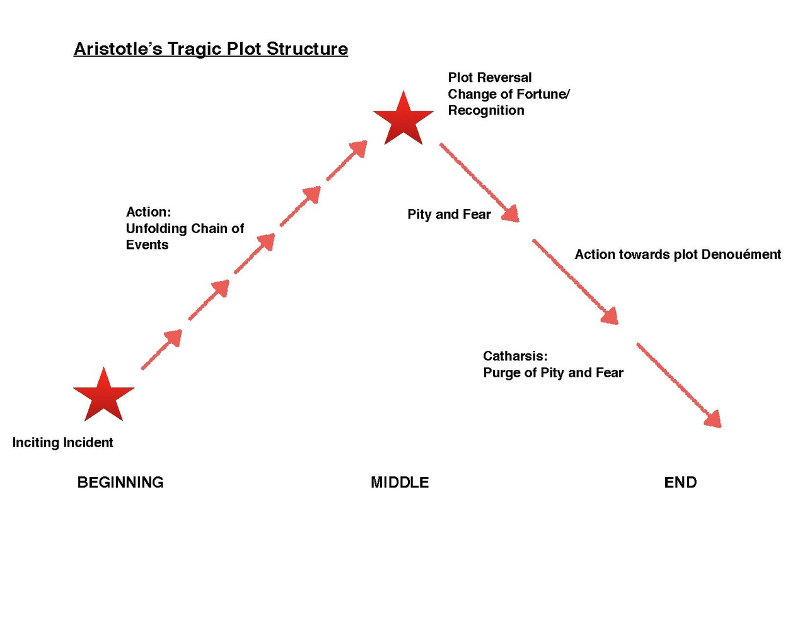
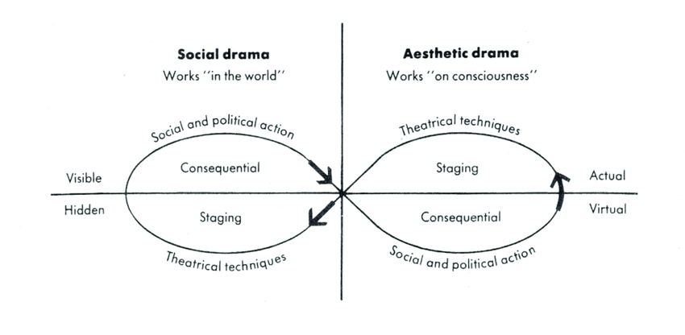
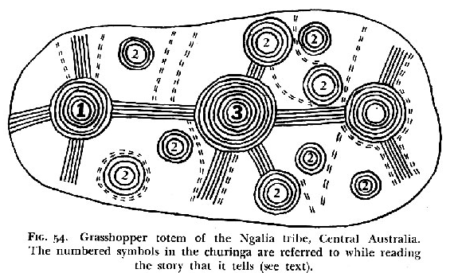

# Business

- Project **data products** due **today by 5:00** 
  - Contact me if you need more time
- Project **final reports** due next **Tuesday, May 7th at noon**
  - Again, contact me if you think you will be late

# Review

- Supervised methods useful in ETA
  - **Document classification** has many uses, e.g. genre prediction
  - Entire field of **stylometrics** seeks to predict authorship, etc. 
- The Bayesian approach goes beyond the Naïve Bayes classifier
  - Frames machine learning in terms of **probability theory**
  - Prediction as **posterior estimation**
  - The importance of **likelihoods**

---

**Likelihoods** show the relationship between  
known **causes** and **effects** 

Each node's outgoing arrows represent likelihoods

Prediction involves going against **the arrow of information**

---

In the case of text, we have seen that  
**topics** play the role of **causes**

Topics (Language Models) $\rightarrow$ Documents

*If topics don't exist, it is necessary to invent them*

---

::: {.columns}
::: {.column}

**Supervised**  
methods

----

Infers *parts* from *whole*

*Informed by* human judgment

Goal is *prediction*

Truth

:::
::: {.column}

**Unsupervised**  
methods

----

Infers *whole* from *parts*

*Informs* human judgement  

Goal is *perception*

Meaning (Sense)

:::
:::

  
(meaning precedes truth)

---

::: {.columns}
::: {.column width="20%" .align-left .smaller}
Making sense of data
:::
::: {.column width="80%"}

:::
:::

---

# The Owl of Minerva {.assertion}

"The Owl of Minerva only flies at dusk."  
-- G.F.W. Hegel

(We really understand things only after they are finished)

---

Text analytics requires **domain knowledge**  
about **languange** and **culture**

---

Some sources of domain knowledge:

Linguistics  
Hermeneutics  
Literary Criticism  
Text Criticism  
Sociolinguistics

---

From linguistics we know:

language is composed of **grammar** and **discourse**

---

Grammar: *finite generative rules*

Discourse: *infinite generated outcomes*

---

From hermeneutics and text criticism we know:

Written documents, as fixed discourse, exhibit a **discursive structure**

E.g. Corpus, Book, Chapter, Verse, Sentence

---

The **utterance** is the elementary unit of discourse

---

Meaning emerges in the assertion of something about somethig (**the "said"**)

**Reference** is an act, a form of *situated action*

"Meanings" as we understand them are recordings of usages in dictionaries

But dictionaries do not capture the **generative mechanism** of language

---

From hermeneutics and sociolinguistics we know:

The generative mechanism of language  
is bound up with **culture**

Culture consists of **ethos** and **worldview**  
encoded in **symbols** shared by **communities**

Language use is shaped this deeper structure  
(**non-ostensive reference**)

---

---

From these domains, an **ontology** of text emerges

**language**  
$\downarrow$  
**culture**  
$\downarrow$  
**text**

The core **methods** of text analytics map onto these levels

---

## Language {.center}

Spelling (phonemes), vocabulary, grammar, etc.  

*modeled by*  

N-gram Language Models  
(characters and strings)  
NLP annotations (POS, etc.)

---

## Culture {.center}

Topics, sentiment, analogies   

*modeled by*  

Topic Models  
Sentiment Lexicons  
Word embeddings

---

## Texts {.center}

Discursive units, sequential structure

*modeled by*

OHCO  
relational data model  
Vector Space Representations

---

Each level, from language to document, involves an increasing amount of **choice**

Therefore, each level involves **increasing information**  
(since information is choice)

# Observations

---

## Observation 1 {.center}

**Information theory** is fundamental to text analytics

Information theory models both the **generative** and the **generated** levels of language

Information theory provides a **unified language** into which most of text analytics can be translated

---

Message = Text

---

## Observation 2 {.center}

The Library of Babel is a **counter-factual narrative** about information

It posits a world in which information is **absent**

A world of **maximum entropy**  
(where every possibility is equally probable)

---

## Observation 3 {.center}

Texts are **sensors** 

They are **transducers** of external social events and internal pyschological dispositions  
(Relative to the author)

Text analytic methods surface the "images"  
left by these causes

---

## Observation 4 {.center}

The information deposited by these images is of two kinds:

1 Structural and static

2 Sequential and dynamic

--- 

Structural information consists of things like language **categories**, **analogies**, principal **components**, **topics**, and **networks** of these things

These analytical artifacts reflect, directly or indirectly,  
fixed **cognitive structures**

These structures can be investigated through  
measures of **similarity** and **contiguity**

i.e. machine learning acts as an associationist **Hume Machine**

---

Sequential information consists of **events** and other time-based information

These reflect life events and social processes

Collections of texts over time reveal these changes, as in newspapers or corpora over time

---

## Observation 5  {.center}

Narratives are **reduced representations** of social process

Narrative strucutres exist in **fiction** and **non-fiction**

Fiction is True!

---

---

---

---

# Plus Delta {.center}

Please fill out the **Plus Delta form** on the menu of the Collab site

# Thanks!